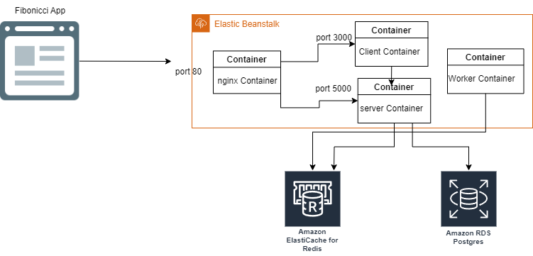

# Deploying a Multi-Container App to Elastic Beanstalk using CircleCI / Travis-CI

This repository contains the code and configuration files for deploying a multi-container application to AWS Elastic Beanstalk using Circle CI/Travis-CI. The application consists of a React front-end, an Express back-end, a Redis cache, and a PostgreSQL database. The application allows users to enter a Fibonacci index and get the corresponding value.

## Overview

AWS Elastic Beanstalk is a Platform-as-a-Service (PaaS) offering by Amazon Web Services (AWS) that simplifies the deployment and management of web applications. In this repository, we'll walk you through the process of deploying a multi-container application to Elastic Beanstalk using CircleCI for automated deployments.

## Repository Structure

The repository is organized as follows:

- `frontend/`: Contains the frontend application code.
- `backend/`: Contains the backend application code.
- `.circleci/`: Contains CircleCI configuration files.
- `Dockerfile`: Dockerfile for building the multi-container application.
- `Docker-Compose.yml`: to run the multi-containers for EBS.
- `.travis.yml`: Contains Travis-CI configuration files to build the Travis-CI pipeline.
## Prerequisites

Before you begin, make sure you have the following prerequisites:

1. [AWS Account](https://aws.amazon.com/) - You need an AWS account to deploy to Elastic Beanstalk.
2. [CircleCI Account](https://circleci.com/) - Sign up for a CircleCI account if you don't have one.
3. AWS CLI - Install and configure the AWS Command Line Interface (CLI).
4. Elastic Beanstalk CLI - Install and configure the Elastic Beanstalk CLI (EB CLI).
5. Install Terraform

## Infrastructure:
The infrastructure code uses Terraform to create and manage the AWS resources, such as the Elastic Beanstalk environment, the VPC, the security groups, redis, RDS(Postgresql), S3 bucket and ElasticBeanstalk.

## Deployment Stage:
The deployment process involves the following steps:

- Building and testing the application locally using Docker Compose
- Pushing the application code and Docker images to GitHub
- Setting up Circle CI to automatically build, test, and deploy the application to AWS Elastic Beanstalk
- Configuring AWS Elastic Beanstalk to use a multi-container Docker environment and connect to AWS RDS and AWS ElastiCache
- Accessing the application URL and verifying its functionality


## Getting Started

Follow these steps to get started with deploying your multi-container app to Elastic Beanstalk using CircleCI:

1. Clone this repository to your local machine:

   ```bash
   git clone https://github.com/AmeerHossam/Deploying-Multi-Container-App-To-ElasticBeanstalk-Using-Circle-CI.git

2. Build The infrastructure
```bash
$ aws configure --profile tf-user
AWS ACCESS KEY ID [None]: <YOUR AK>
AWS Secret Access Key [None]: <YOUR SK>
Default region name [None]: <In my case I used us-east-1>
Default output formate [None]: json

$ cd infrastructure
$ terraform init
$ terraform apply --auto-approve
